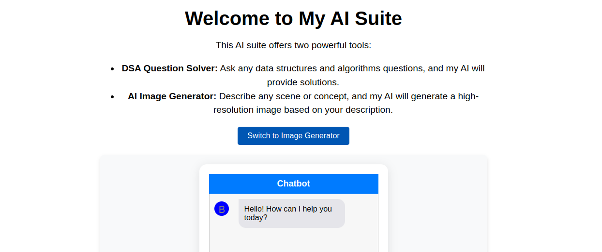
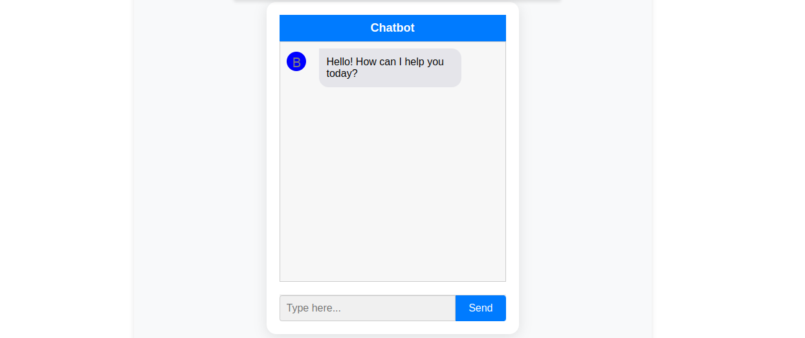
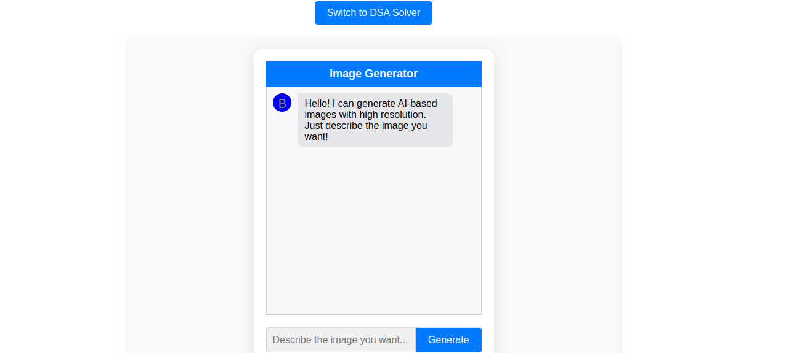

# ChatBot

This is the ChatBot application, built with React , Node.js and Express.

## Features

- Real-time chat functionality.
- Image generation with AI.
- Customizable prompts.

## Installation

1. Clone the repository:

   ```bash
   git clone https://github.com/your-username/chatBot-backend.git
   cd chatBot
   npm install
   Set up environment variables by creating a .env file
   npm start





